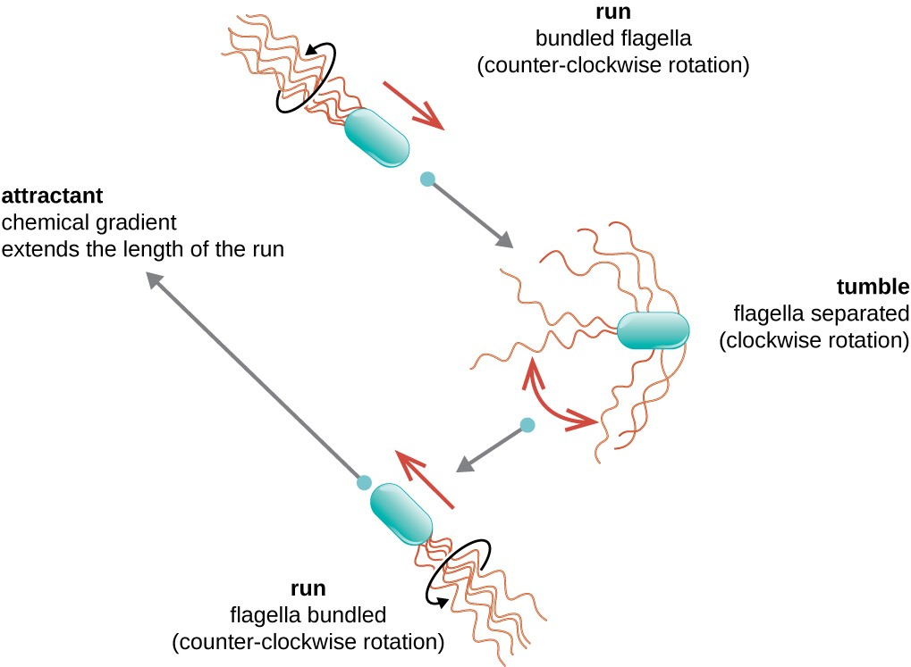

# programming_formalisms_project_autumn_2024

[](https://github.com/programming-formalisms/programming_formalisms_project_autumn_2024/actions/workflows/check_links.yaml)
[](https://github.com/programming-formalisms/programming_formalisms_project_autumn_2024/actions/workflows/check_package.yaml)
[](https://github.com/programming-formalisms/programming_formalisms_project_autumn_2024/actions/workflows/check_spelling.yaml)
[](https://github.com/programming-formalisms/programming_formalisms_project_autumn_2024/actions/workflows/measure_code_coverage.yml)
[](https://codecov.io/github/programming-formalisms/programming_formalisms_project_autumn_2024)

Learners' project of the Programming Formalisms course of autumn 2024.

## Goal

To simulate bacterial movement in 2D space.

One way to model bacterial movement is 
the run and tumble model,
where 'run' is going straight in a direction,
and 'tumble' is picking a random direction.
The 'run' lasts longer when a bacterium
finds more and more nutrients (e.g. dissolved
sugars), and lasts shorter
when finding less and less nutrients.



> Image from [coursehero](https://www.coursehero.com/study-guides/microbiology/unique-characteristics-of-prokaryotic-cells/)

## Project state

This will change over the course's time.

Parameter                |Value
-------------------------|-----------------------
Branching setup          |Trunk-based development
Merge workflow           |Not applicable
Testing                  |None
Continuous integration   |None
Can be used as a package?|No

## Team roles

Role              |Name
------------------|-----------------------
Product owner     |.
Software architect|.
Data manager      |.
Lead developer    |.

## Usage

> The lead developer and product owner are free to change this,
> if they both agree on the new usage.

```python
from bacsim.simulation import run_experiment
run_experiment("parameters.csv", "results.csv")
```

## Internal links

 * [design](design/README.md): design documents
 * [learners](learners/README.md): place to keep notes and do exercises on an individual basis

<!-- markdownlint-disable MD013 --><!-- Tables cannot be split up over lines, hence will break 80 characters per line -->

Filename                                  |Descriptions
------------------------------------------|--------------------------------------------------------------------------------------------------------------------------------------
[mlc_config.json](mlc_config.json)        |Configuration of the link checker, use `markdown-link-check --config mlc_config.json --quiet docs/**/*.md` to do link checking locally
[.spellcheck.yml](.spellcheck.yml)        |Configuration of the spell checker, use `pyspelling -c .spellcheck.yml` to do spellcheck locally
[.wordlist.txt](.wordlist.txt)            |Whitelisted words for the spell checker, use `pyspelling -c .spellcheck.yml` to do spellcheck locally
[.markdownlint.jsonc](.markdownlint.jsonc)|Configuration of the markdown linter, use `markdownlint "**/*.md"` to do markdown linting locally. The name of this file is a default name.
[.markdownlintignore](.markdownlintignore)|Files ignored by the markdown linter, use `markdownlint "**/*.md"` to do markdown linting locally. The name of this file is a default name.

<!-- markdownlint-enable MD013 -->

## External links

 * [Programming Formalisms GitHub repository](https://github.com/UPPMAX/programming_formalisms)

## References

 * [Wang et al., 2011] Wang, Charles CN, et al. "Simulation of bacterial chemotaxis by the random run and tumble model." 2011 IEEE 11th International Conference on Bioinformatics and Bioengineering. IEEE, 2011.
